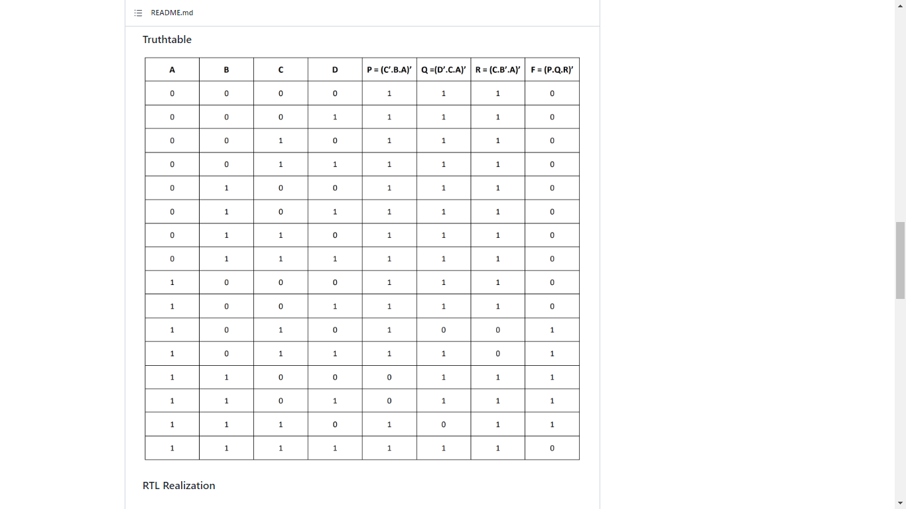
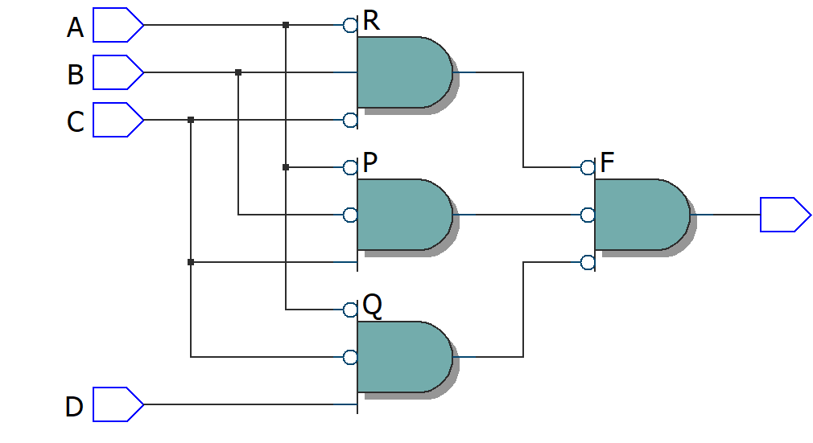
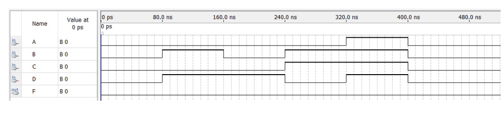
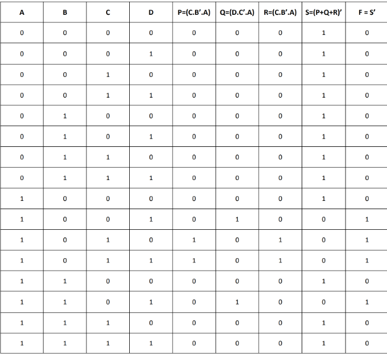
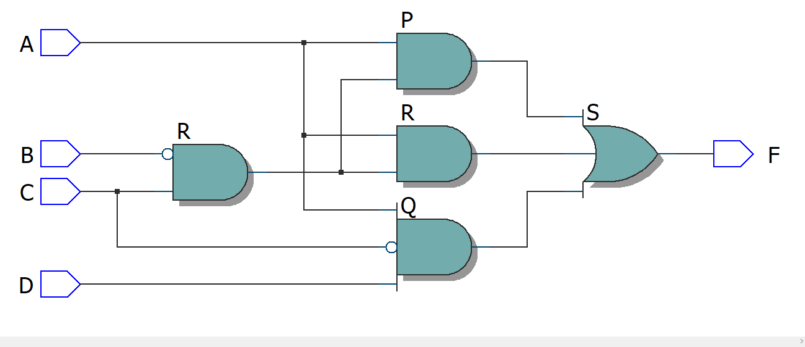

# Experiment--04-Implementation-of-combinational-logic-using-universal-gates-
 ## Implementation-of-Half-subtractor-and-Full-subtractor-circuit
## AIM:
To implement the given logic function using NAND and NOR gates and to verify its operation in Quartus using Verilog programming.
F=((C'.B.A)'(D'.C.A)'(C.B'.A)')' using NAND gate
F=(((C.B'.A)+(D.C'.A)+(C.B'.A))')' using NOR gate


## Equipments Required:
## Hardware – PCs, Cyclone II , USB flasher
## Software – Quartus prime
## Theory
 
 
 
 


## Procedure

1.Create a project with required entities.

2.Create a module along with respective file name.

3.Run the respective programs for the given boolean equations.

4.Run the module and get the respective RTL outputs.

5.Create university program(VWF) for getting timing diagram.

6.Give the respective inputs for timing diagram and obtain the results.


## Program:
/*
Program to design a Implementation of combinational logic using universal gates-  and verify its truth table in quartus using Verilog programming.
Developed by: V.NAVYA.
RegisterNumber:  212221230069
*/
```

module Combination(A,B,C,D,F);
input A,B,C,D;
output F;
wire P,Q,R;
assign P = C&(~B)&(~A);
assign Q = D&(~C)&(~A);
assign R = (~C)&B&(~A);
assign F = (~P&~Q&~R);
endmodule
```
```

module norcombination(A,B,C,D,F);
input A,B,C,D;
output F;
wire P,Q,R,S;
assign P = C&(~B)&A;
assign Q = D&(~C)&A;
assign R = C&(~B)&A;
assign S = ~(P|Q|R);
not(F,S);
endmodule
```

## Output:

## Truthtable

USING NAND GATE




##  RTL realization




## Timing diagram 



## Truthtable

USING NOR GATE




##  RTL realization




## Timing diagram 


## Result:
 
 Thus implementation of logic functions using NAND and NOR gates is done and its operation is verified in Quartus using Verilog programming.
